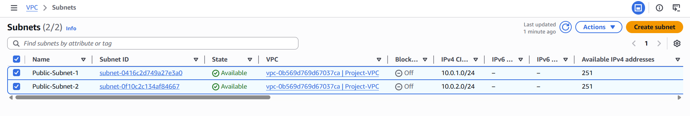
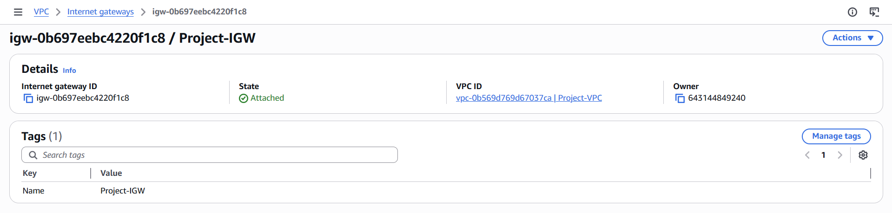
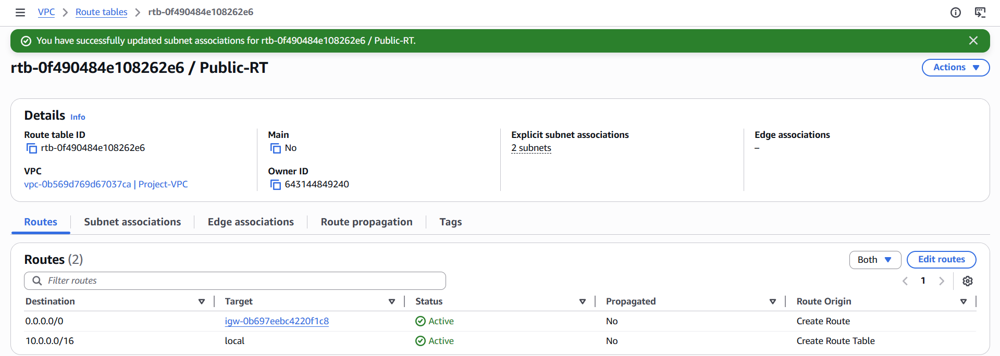

# aws-scalable-web-architecture

This project demonstrates a **highly available** and scalable **web application** architecture using AWS services including **Application Load Balancer (ALB), EC2, Auto Scaling Group, and CloudWatch**.

**📌 Features:**

-**Load balancing using ALB**
-Auto Scaling based on CPU utilization
-Multi-instance deployment across availability zones
-Real-time monitoring with CloudWatch
-SNS notifications for alerts**

**Step 1 :**
Created a **Virtual Private Cloud (VPC)** with **CIDR block 10.0.0.0/16** to establish an isolated and secure networking environment in AWS. 

This VPC acts as the foundational layer where all cloud resources such as EC2 instances, load balancers, and auto scaling groups are deployed.

**Step 2 :**

Created two **public subnets (10.0.1.0/24 and 10.0.2.0/24** in different **Availability Zones**to distribute resources and ensure high availability. 

Enabled **auto-assign public IP** so instances can be accessed via the internet.

**Step 3 :**

Configured and attached an **Internet Gateway** to the VPC to allow **communication** between instances in the VPC and the internet.

**Step 4 :**

Created a **route table** and added a default **route (0.0.0.0/0)** pointing to the Internet Gateway. 

Associated the route table with public subnets to **allow internet access**.

**Step 5 :**

Configured a **security group** allowing inbound **HTTP (port 80)** for web traffic and **SSH (port 22)** for secure administrative access.

