# aws-scalable-web-architecture

This project demonstrates a **highly available** and scalable **web application** architecture using AWS services including **Application Load Balancer (ALB), EC2, Auto Scaling Group, and CloudWatch**.

**📌 Features:**

- **Load balancing using ALB**
-Auto Scaling based on CPU utilization
-Multi-instance deployment across availability zones
-Real-time monitoring with CloudWatch
-SNS notifications for alerts**

**Step 1 :**
Created a **Virtual Private Cloud (VPC)** with **CIDR block 10.0.0.0/16** to establish an isolated and secure networking environment in AWS. 

This VPC acts as the foundational layer where all cloud resources such as EC2 instances, load balancers, and auto scaling groups are deployed.

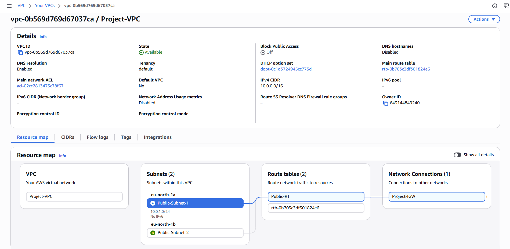

**Step 2 :**

Created two **public subnets (10.0.1.0/24 and 10.0.2.0/24** in different **Availability Zones**to distribute resources and ensure high availability. 

Enabled **auto-assign public IP** so instances can be accessed via the internet.

**Step 3 :**

Configured and attached an **Internet Gateway** to the VPC to allow **communication** between instances in the VPC and the internet.

**Step 4 :**

Created a **route table** and added a default **route (0.0.0.0/0)** pointing to the Internet Gateway. 

Associated the route table with public subnets to **allow internet access**.

**Step 5 :**

Configured a **security group** allowing inbound **HTTP (port 80)** for web traffic and **SSH (port 22)** for secure administrative access.

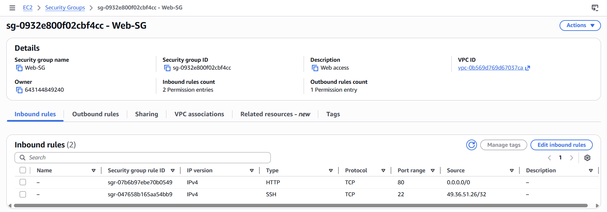

**Step 6 :**

Launched **two EC2 instances** in **separate public subnets** and **installed Apache web servers** using user data scripts. 

These instances act as backend servers that serve web content to users.

- **User data :**

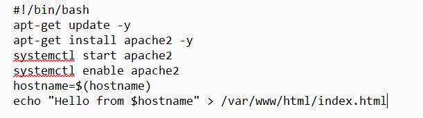

- **Server 1 :**

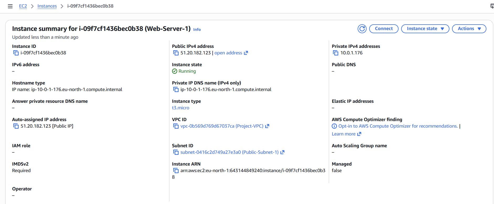

- **Server 2 :**

**Step 7 :**

Created a **target group** and **registered EC2 instances** as targets. 

This group acts as an intermediary between the **load balancer and backend instances**, enabling **efficient traffic routing and health monitoring**.

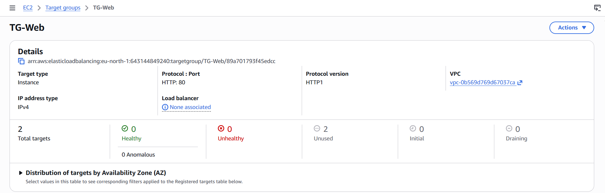

- **Target group health check settings :**

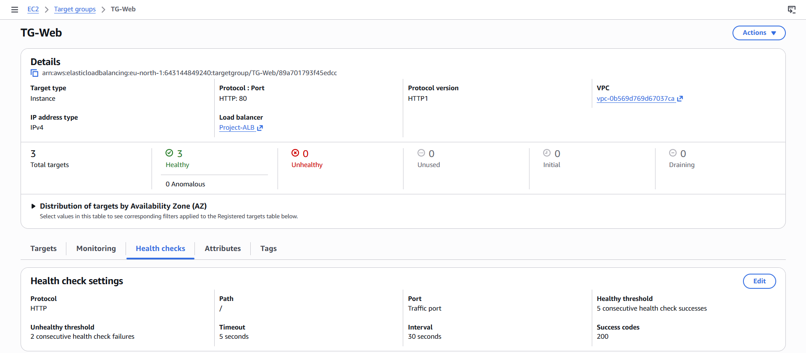

**Step 8 :**

Configured an **Application Load Balancer** to distribute incoming **HTTP traffic across multiple EC2 instanc**es using the **target group**.

This ensures efficient **load distribution** and **high availability**.

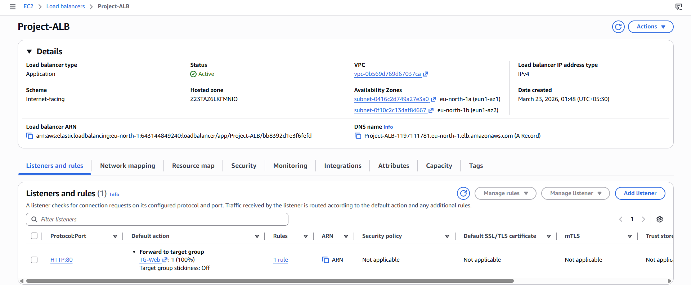

- **ALB listener & rules :**

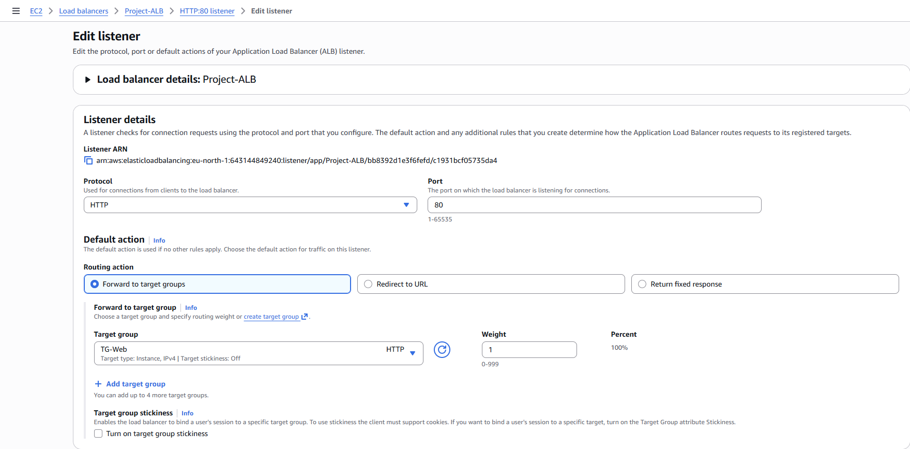

**Step 9 :**

Created a **launch template** defining instance configuration such as AMI, instance type, security group, and user data. 

This template is used by **Auto Scaling to launch new instances automatically**.

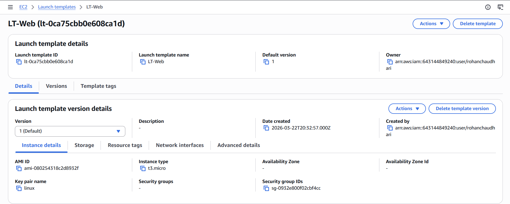

- **User data :**

**Step 10 :**

Configured an **Auto Scaling Group** using the **launch template** to **automatically adjust the number of EC2 instances** based on **traffic demand**. 

**Integrated** it with the **load balancer** to **maintain availability**.

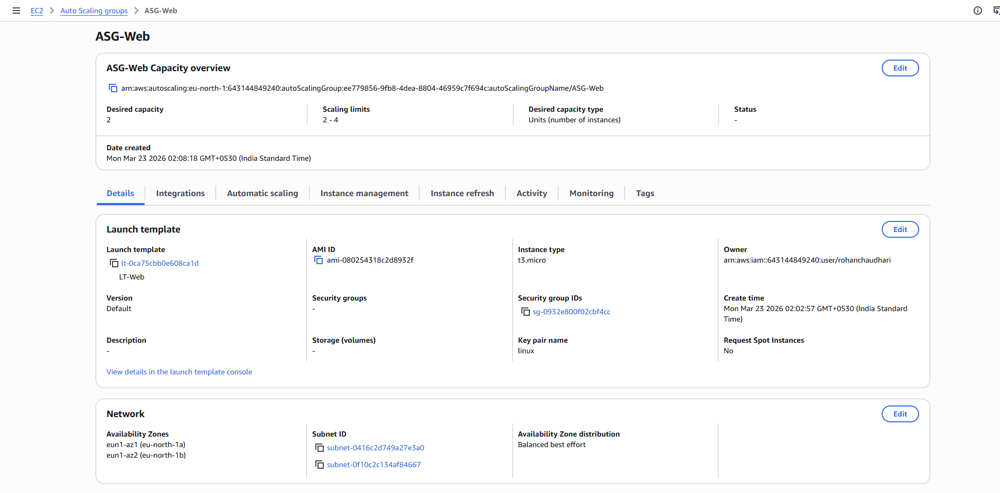

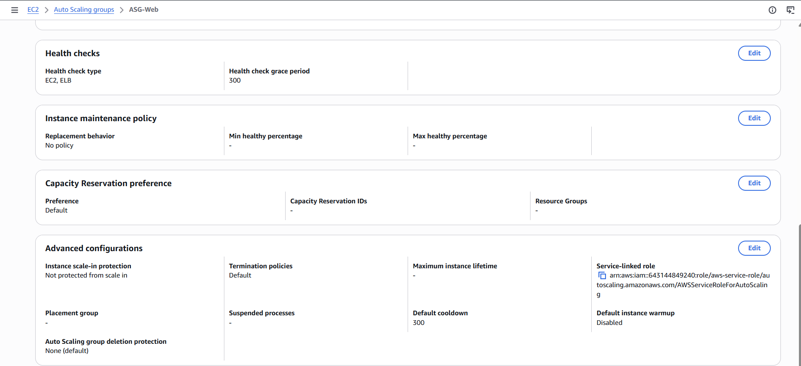

**This shows the Auto Scaling Group activity :**

- **New instances launched** automatically (`i-0b2a60492de66116d`, `i-0c42cf23a952454ca`) when CPU usage or traffic increased.
- **Instances terminated** automatically (`i-0c42cf23a952454ca`) when demand decreased.
- Demonstrates **dynamic scaling**, ensuring high availability while optimizing cost.

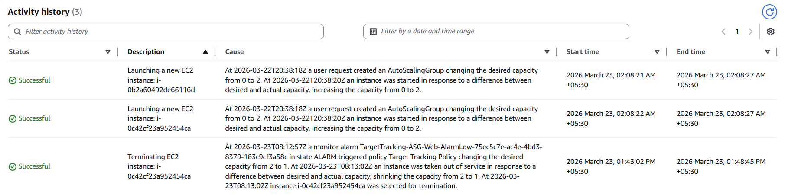

**Step 11 :**

Configured **CloudWatch alarms** to monitor EC2 **CPU utilization** and **trigger scaling actions** when **thresholds** are exceeded.

And configured **SNS notification** when alarm get trigger.

- By default, ASG alarms monitor **average CPU**, which may **not reach the threshold** if the load is spread across multiple instances.  

- So I created :

- Created **per-instance CPU alarms** for each EC2 instance.  
- Connected to **both servers via SSH**.  
- Ran **stress test commands** to simulate high CPU usage and verify scaling.

**Per-Instance CloudWatch Alarms (Server 1)  :**

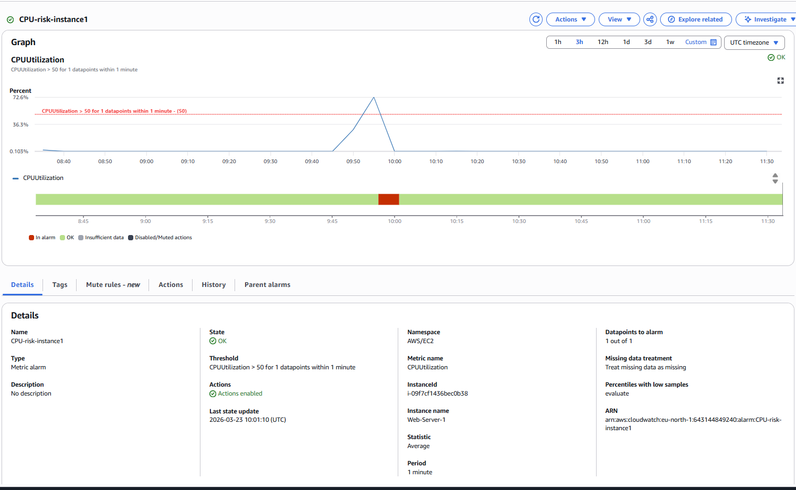

**Stress Testing (Server 1) :**

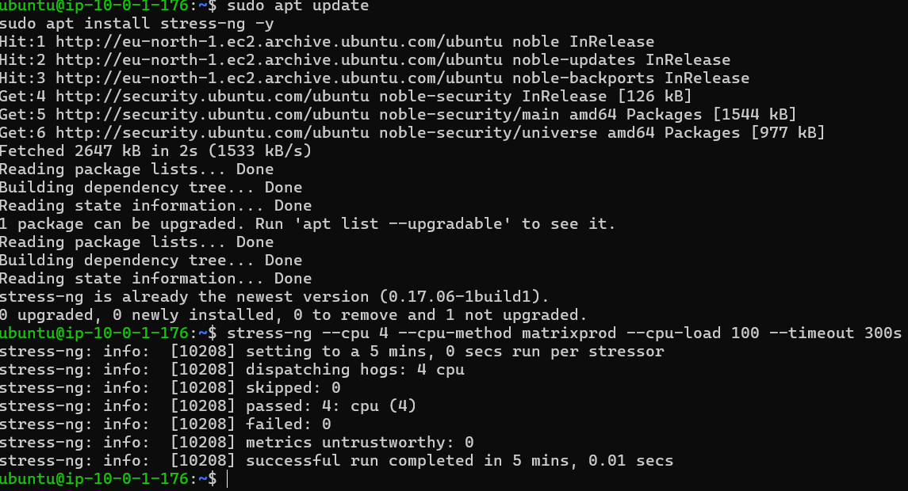

**Per-Instance CloudWatch Alarms (Server 2)  :**

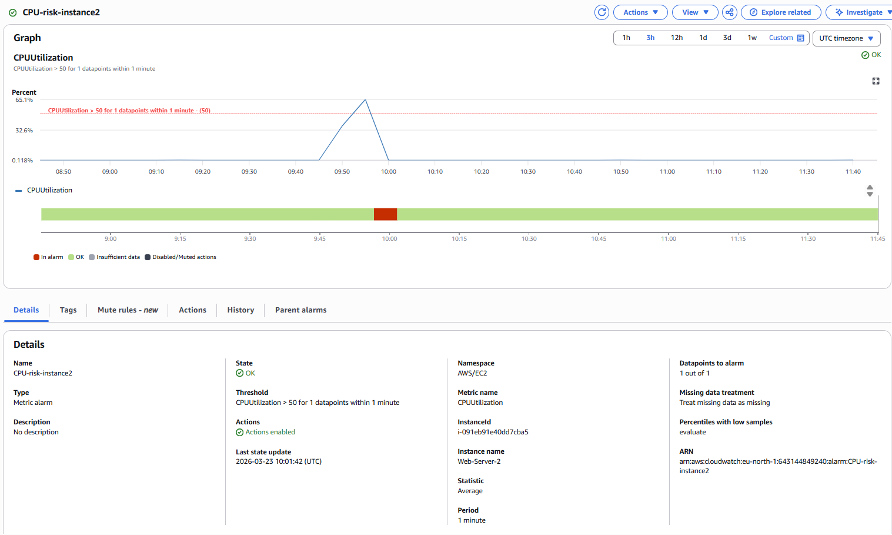

**Stress Testing (Server 2) :**

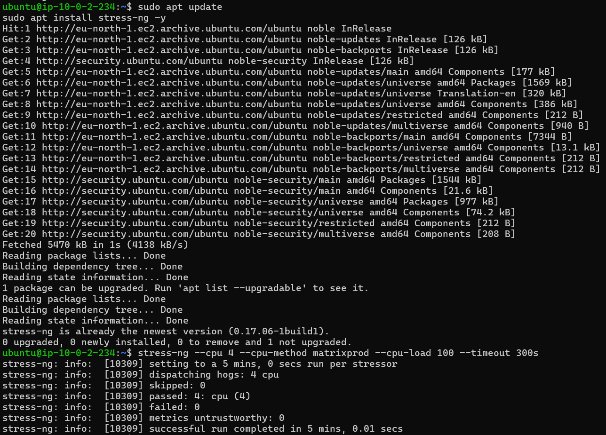

**CloudWatch alarms (Triggered):**

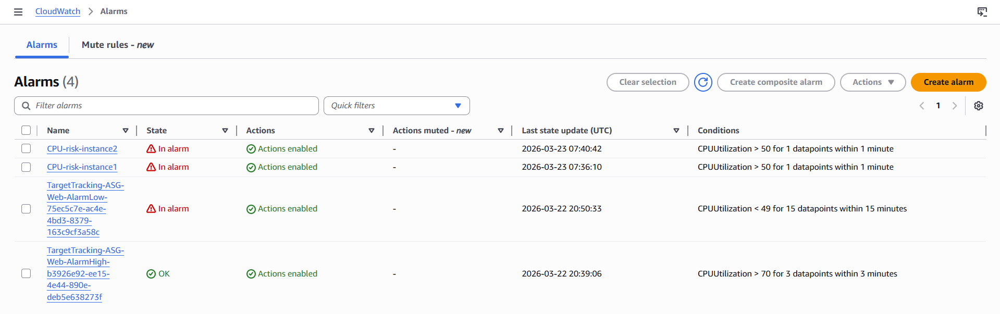

**SNS notification :**

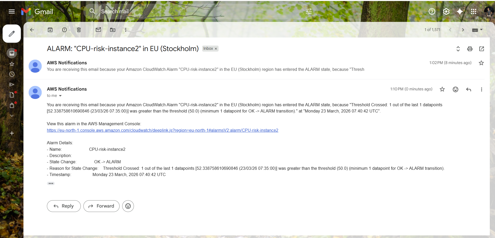

**Step 12 :**

Performed **testing** by accessing the **load balancer DNS**, refreshing requests to **observe traffic distribution**, and **validating auto scaling behavior**.

**Summary :**

**This project demonstrates a scalable and highly available web application architecture using AWS services including EC2, ALB, Auto Scaling, and CloudWatch.**

**It solves real-world challenges such as traffic distribution, fault tolerance, and automatic scaling while ensuring high performance and reliability.**

